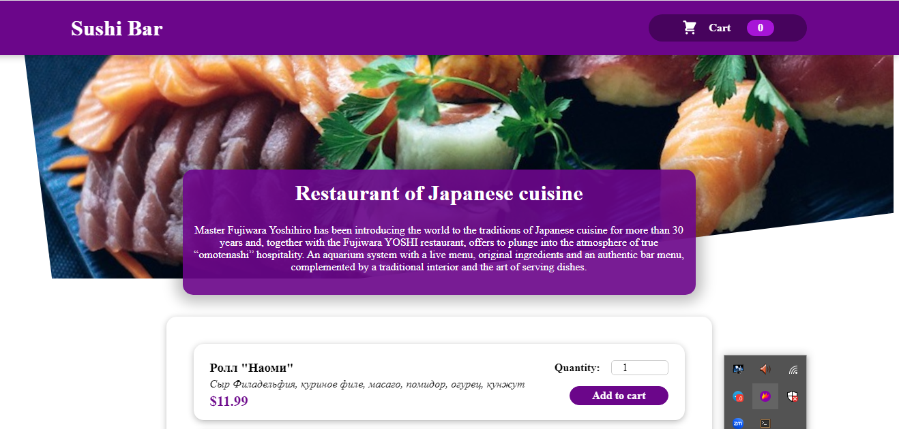
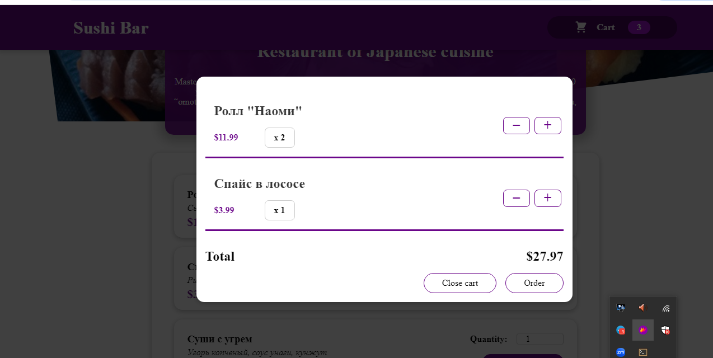

## 🍔 ORDER_FOOD_APP
An intuitive and user-friendly food ordering application built with React. This app allows users to browse a variety of dishes, add them to their cart, and place orders seamlessly.

## 🚀 Features
- 🛒 **Add to Cart** – Easily add and remove food items from the cart.
- 📋 **Menu Display** – View a categorized list of food items with images and prices.
- 🕒 **Real-time Order Updates** – Track order status dynamically.
- 📱 **Responsive Design** – Works smoothly on mobile and desktop.

## 🛠️ Tech Stack
- **Frontend:** React, Vite, Context API  
- **State Management:** Context API  

## 🔧 Installation & Setup

### 1️⃣ Clone the repository:
```sh
git clone https://github.com/frontdev24kv/order_food_app.git
```

### 2️⃣ Navigate to the project folder:
```sh
cd order_food_app
```
### 3️⃣ Install dependencies:
```sh
npm install
```

### 4️⃣ Start the development server:
```sh
npm run dev
```
### 5️⃣ Open your browser and go to:
```sh
http://localhost:5173
```

## 📂 Project Structure:
```csharp
order_food_app/
│── src/
│   ├── assets/           # Images & icons
│   ├── components/       # Reusable UI components
│   ├── store/            # State management
│   ├── App.jsx           # Main App component
│   ├── main.jsx          # Entry point
│── public/               # Static assets
│── package.json          # Dependencies & scripts
│── README.md             # Project documentation
```
### 📸 Screenshots
### 🏠 Home Page


### 🛒 Cart Page

